# Threat Model (STRIDE) — `CDZY62OKIPJAB4HH44BI6PPYO4NGFQV7INDJH4KU6V6RNNSLCTUX3SCS`

Network mainnet · generated at 2026-09-17 · official Stellar template (*STRIDE-template*, developers.stellar.org/docs/build/security-docs/threat-modeling).

Draft generated by soroguard from the deployed WASM. Every claim carries its evidence tier: **A** = bytecode fact, **B** = fact observed on-chain, **C** = inference. The sections the analysis cannot support appear as a declared gap — never filled with generic text. **Human review is mandatory before submission.**

---

## What are we working on?

**Gap to be filled by the team.** soroguard derives this section from the deployed WASM and does not know the contract's business purpose. The descriptive paragraph the template asks for — what the protocol does, who the actors are, what value it holds in custody, which trust assumptions live off-chain — is not derivable from the bytecode and has to be written by the people who built the system. What follows is only the measured technical surface.

### Analyzed object

| Field | Value |
|---|---|
| Contract ID | `CDZY62OKIPJAB4HH44BI6PPYO4NGFQV7INDJH4KU6V6RNNSLCTUX3SCS` |
| Network | mainnet |
| WASM hash | `f340242d143b42e273f628f44ccb907f55f5beb256f3de17de2c005fcdbc9783` |
| WASM size | 34945 bytes |
| Generated at | 2026-09-17 (UTC) |
| Call graph soundness | complete — no `call_indirect` in the module |

The whole document describes **this binary**, identified by the hash above — not the repository it supposedly came from. That is the only thing the analysis can assert: source and deployment diverge often, and what runs in production is the WASM.

### How to read the evidence

| Tier | Means | Who can verify |
|---|---|---|
| **A** | bytecode fact: reachability in the deployed WASM's call graph | anyone, re-derivable from the binary |
| **B** | fact observed on-chain: events actually emitted in the observed window | anyone, via RPC |
| **C** | inference — requires human review. Covers threat class, severity and remediation | human review only |

One asymmetry changes how everything below reads: **"does not reach `require_auth`" is a sound negative for this module's call graph** (when that graph is complete) — it says nothing about authorization enforced inside a contract reached through `call`/`try_call`, nor about a custom account's `__check_auth`. **"reaches `put_contract_data`", on the other hand, is an over-approximation** — the write may sit on a branch that entrypoint never executes. That is why every positive claim carries its hop count, and long paths are flagged for confirmation instead of asserted.

This module exports `__check_auth`, so it is a **custom account**: authorization is implemented *by* `__check_auth`, not requested through `require_auth`. "No `require_auth` path" on its entrypoints is the expected shape for this kind of contract and is not itself a finding.

### Exported surface (tier A)

15 exported, 13 invocable entrypoints · 10 reach `require_auth*` · 9 reach storage write · 5 reach `call`/`try_call` · 1 reaches self-code replacement. The difference is 2 reserved `__*` exports (`__constructor` and `__check_auth`) excluded from the invocable count: the host refuses to invoke them directly (CAP-0058), so they are not evaluated as attack surface.

| Entrypoint | auth | writes | durability | event | upgrade | cross-call | fanout |
|---|---|---|---|---|---|---|---|
| `upgrade` | yes | yes | `inst` | no | yes | no | 7 |
| `get_context_rule` | no | no | — | no | no | no | 35 |
| `get_context_rules` | no | no | — | no | no | no | 40 |
| `get_context_rules_count` | no | no | — | no | no | no | 15 |
| `add_context_rule` | yes | yes | `pers`, `inst` | yes | no | yes | 69 |
| `update_context_rule_name` | yes | yes | `pers` | yes | no | no | 45 |
| `update_context_rule_valid_until` | yes | yes | `pers` | yes | no | no | 47 |
| `remove_context_rule` | yes | yes | `pers`, `inst` | yes | no | yes | 63 |
| `add_signer` | yes | yes | `pers` | yes | no | no | 59 |
| `remove_signer` | yes | yes | `pers` | yes | no | no | 60 |
| `add_policy` | yes | yes | `pers` | yes | no | yes | 63 |
| `remove_policy` | yes | yes | `pers` | yes | no | yes | 63 |
| `execute` | yes | no | — | no | no | yes | 4 |

In every column, "yes" means it **reaches** the corresponding host function on some call-graph path, not that it always executes it.

**durability** is the `StorageType` of the writes reached: `temp`, `pers`, `inst`. The three are not interchangeable — `temp` is deleted for good on expiry, `inst` shares one 64 KiB entry. `?` means the type reaches the call computed; `—` means no write. Read literally at 11 of 12 storage call sites. It describes the storage layout; it is not a finding.

### Inferred data stores

- Keys read from the module's linear memory: `MIGRATING`.
- Likely keys (partial read of the data section): `Count`, `Fingerprint`, `Ids`, `Meta`, `NextId`, `Policies`, `Signers`.

Durability is **not** attributable to a key from this list. The `StorageType` is readable per call site (see the `durability` column above), but pairing *which key* goes to *which durability* needs dataflow from the key to the call, which this analysis does not do — a single entrypoint routinely writes several keys at different durabilities. Do not assume the durability of any key below.

### On-chain activity observed (tier B)

Window: ledgers 64347474–64468134 (120661 ledgers, ~185.47h).

window of 120661 ledgers (~185 h) — limited by RPC retention.

No event observed in the window: **no event of any topic was observed for this contract in the window — absence of traffic, not a traffic profile.** The count is real and still does not support a monitoring threshold.

Topics declared in the spec and not observed in the window: `simple_policy_enforced`, `spending_limit_policy_enforced`, `weighted_policy_enforced`, `context_rule_added`, `context_rule_updated`, `context_rule_removed`, `signer_added`, `signer_removed`, `policy_added`, `policy_removed`, `set_root`, `set_claimed`, `paused`, `unpaused`. Absence over a ~185.47 h window is not evidence the action never happens — only that it did not happen in that window.

### Data flow diagram

```mermaid
%% soroguard — data-flow diagram derived from the deployed WASM
%% contract CDZY62OKIPJAB4HH44BI6PPYO4NGFQV7INDJH4KU6V6RNNSLCTUX3SCS · network mainnet · generated at 2026-09-17
%% call graph: complete across 15 entrypoint(s)
%% legend: reaches X n = there is a path of n hop(s) from the export to host function X.
%% † = path longer than 2 hops. The positive is over-approximate (tier C): it probably goes through a shared helper and the host function may sit on a branch this entrypoint never executes. Confirm before treating it as a finding. Same threshold and same hop count as detect.ts.
flowchart LR
  subgraph tb_externo["Outside the contract — untrusted actors"]
    e_anonimo["Anonymous invoker — any address"]
    e_autorizado["Authenticated invoker — Address required by require_auth* on at least one reachable path"]
    e_deployer["Deployer — same transaction as the deployment (atomic constructor, CAP-0058)"]
    e_host["Soroban host — invokes the reserved entrypoints (__ prefix, CAP-0058)"]
    e_observador["Off-chain consumer of the event stream — getEvents"]
  end
  subgraph tb_auth["require_auth* reachable on some path — access control (admin-shaped) and self-authorization (caller authorizing its own address) are both inside; the name-shape split is in the threat model's Spoofing gap"]
    p_upgrade(["upgrade — reaches (hops to host fn): require_auth 1, write 1, self-code upgrade 1"])
    p_add_context_rule(["add_context_rule — reaches (hops to host fn): require_auth 1, read 4†, write 3†, event 2, cross-call 4† ⚠ † = via shared helper, tier C"])
    p_update_context_rule_name(["update_context_rule_name — reaches (hops to host fn): require_auth 1, read 3†, write 2, event 2 ⚠ † = via shared helper, tier C"])
    p_update_context_rule_valid_until(["update_context_rule_valid_until — reaches (hops to host fn): require_auth 1, read 3†, write 2, event 2 ⚠ † = via shared helper, tier C"])
    p_remove_context_rule(["remove_context_rule — reaches (hops to host fn): require_auth 1, read 3†, write 2, event 1, cross-call 2 ⚠ † = via shared helper, tier C"])
    p_add_signer(["add_signer — reaches (hops to host fn): require_auth 1, read 3†, write 2, event 1 ⚠ † = via shared helper, tier C"])
    p_remove_signer(["remove_signer — reaches (hops to host fn): require_auth 1, read 3†, write 2, event 1 ⚠ † = via shared helper, tier C"])
    p_add_policy(["add_policy — reaches (hops to host fn): require_auth 1, read 3†, write 2, event 1, cross-call 3† ⚠ † = via shared helper, tier C"])
    p_remove_policy(["remove_policy — reaches (hops to host fn): require_auth 1, read 3†, write 2, event 1, cross-call 2 ⚠ † = via shared helper, tier C"])
    p_execute(["execute — reaches (hops to host fn): require_auth 1, cross-call 1"])
  end
  subgraph tb_aberto["No authorization boundary — no path reaches require_auth* in this module (sound for this call graph)"]
    p_get_context_rule(["get_context_rule — reaches (hops to host fn): read 3† ⚠ † = via shared helper, tier C"])
    p_get_context_rules(["get_context_rules — reaches (hops to host fn): read 3† ⚠ † = via shared helper, tier C"])
    p_get_context_rules_count(["get_context_rules_count — reaches (hops to host fn): read 4† ⚠ † = via shared helper, tier C"])
  end
  subgraph tb_ciclo["Lifecycle — invoked by the deployment or by the host, not by an arbitrary caller"]
    p___constructor(["__constructor — reaches (hops to host fn): read 4†, write 3†, event 2, cross-call 4† ⚠ † = via shared helper, tier C"])
    p___check_auth(["__check_auth — reaches (hops to host fn): require_auth 1, read 4†, cross-call 2 ⚠ † = via shared helper, tier C"])
  end
  subgraph tb_crosscall["Third-party code — reached through call/try_call"]
    x_callee[["Another contract — address resolved at runtime, not determinable from the bytecode"]]
  end
  s_storage[("Contract storage")]
  s_MIGRATING[("MIGRATING (certain)")]
  s_Count[("Count (likely)")]
  s_Fingerprint[("Fingerprint (likely)")]
  s_Ids[("Ids (likely)")]
  s_Meta[("Meta (likely)")]
  s_NextId[("NextId (likely)")]
  s_Policies[("Policies (likely)")]
  s_Signers[("Signers (likely)")]
  e_autorizado -.->|"invokes — require_auth reachable"| p_upgrade
  e_deployer -.->|"deploy — atomic invocation"| p___constructor
  e_host -.->|"authorization check"| p___check_auth
  e_anonimo -.->|"invokes — no authorization check within reach (sound for this call graph)"| p_get_context_rule
  e_anonimo -.->|"invokes — no authorization check within reach (sound for this call graph)"| p_get_context_rules
  e_anonimo -.->|"invokes — no authorization check within reach (sound for this call graph)"| p_get_context_rules_count
  e_autorizado -.->|"invokes — require_auth reachable"| p_add_context_rule
  e_autorizado -.->|"invokes — require_auth reachable"| p_update_context_rule_name
  e_autorizado -.->|"invokes — require_auth reachable"| p_update_context_rule_valid_until
  e_autorizado -.->|"invokes — require_auth reachable"| p_remove_context_rule
  e_autorizado -.->|"invokes — require_auth reachable"| p_add_signer
  e_autorizado -.->|"invokes — require_auth reachable"| p_remove_signer
  e_autorizado -.->|"invokes — require_auth reachable"| p_add_policy
  e_autorizado -.->|"invokes — require_auth reachable"| p_remove_policy
  e_autorizado -.->|"invokes — require_auth reachable"| p_execute
  s_storage -->|"inferred key — confidence certain"| s_MIGRATING
  s_storage -->|"inferred key — confidence likely"| s_Count
  s_storage -->|"inferred key — confidence likely"| s_Fingerprint
  s_storage -->|"inferred key — confidence likely"| s_Ids
  s_storage -->|"inferred key — confidence likely"| s_Meta
  s_storage -->|"inferred key — confidence likely"| s_NextId
  s_storage -->|"inferred key — confidence likely"| s_Policies
  s_storage -->|"inferred key — confidence likely"| s_Signers
  p_upgrade -->|"reaches write"| s_storage
  p___constructor -->|"reaches read and write"| s_storage
  p___check_auth -->|"reaches read"| s_storage
  p_get_context_rule -->|"reaches read"| s_storage
  p_get_context_rules -->|"reaches read"| s_storage
  p_get_context_rules_count -->|"reaches read"| s_storage
  p_add_context_rule -->|"reaches read and write"| s_storage
  p_update_context_rule_name -->|"reaches read and write"| s_storage
  p_update_context_rule_valid_until -->|"reaches read and write"| s_storage
  p_remove_context_rule -->|"reaches read and write"| s_storage
  p_add_signer -->|"reaches read and write"| s_storage
  p_remove_signer -->|"reaches read and write"| s_storage
  p_add_policy -->|"reaches read and write"| s_storage
  p_remove_policy -->|"reaches read and write"| s_storage
  p___constructor -.->|"reaches call"| x_callee
  p___check_auth -.->|"reaches call"| x_callee
  p_add_context_rule -.->|"reaches call"| x_callee
  p_remove_context_rule -.->|"reaches try_call"| x_callee
  p_add_policy -.->|"reaches call"| x_callee
  p_remove_policy -.->|"reaches try_call"| x_callee
  p_execute -.->|"reaches call"| x_callee
  p___constructor -.->|"reaches contract_event"| e_observador
  p_add_context_rule -.->|"reaches contract_event"| e_observador
  p_update_context_rule_name -.->|"reaches contract_event"| e_observador
  p_update_context_rule_valid_until -.->|"reaches contract_event"| e_observador
  p_remove_context_rule -.->|"reaches contract_event"| e_observador
  p_add_signer -.->|"reaches contract_event"| e_observador
  p_remove_signer -.->|"reaches contract_event"| e_observador
  p_add_policy -.->|"reaches contract_event"| e_observador
  p_remove_policy -.->|"reaches contract_event"| e_observador
  classDef proc fill:#eaf2fb,stroke:#3b6ea5,color:#10243a
  class p_upgrade,p___constructor,p___check_auth,p_get_context_rule,p_get_context_rules,p_get_context_rules_count,p_add_context_rule,p_update_context_rule_name,p_update_context_rule_valid_until,p_remove_context_rule,p_add_signer,p_remove_signer,p_add_policy,p_remove_policy,p_execute proc
  classDef store fill:#fdf3e0,stroke:#b8860b,color:#3a2c10
  class s_storage,s_MIGRATING,s_Count,s_Fingerprint,s_Ids,s_Meta,s_NextId,s_Policies,s_Signers store
  classDef ext fill:#f2f2f2,stroke:#7a7a7a,color:#222222
  class e_anonimo,e_autorizado,e_deployer,e_host,e_observador ext
  classDef outro fill:#fdeaea,stroke:#c05252,color:#3a1010
  class x_callee outro
```

The diagram comes straight out of the analysis: each `process` is a module export, each `store` is an inferred storage key, and each edge marked as a boundary is a point where execution crosses outside the contract (`call`/`try_call`) or where authorization is required.

| Trust boundary | Contained nodes |
|---|---|
| Outside the contract — untrusted actors | `e_anonimo`, `e_autorizado`, `e_deployer`, `e_host`, `e_observador` |
| require_auth* reachable on some path — access control (admin-shaped) and self-authorization (caller authorizing its own address) are both inside; the name-shape split is in the threat model's Spoofing gap | `p_upgrade`, `p_add_context_rule`, `p_update_context_rule_name`, `p_update_context_rule_valid_until`, `p_remove_context_rule`, `p_add_signer`, `p_remove_signer`, `p_add_policy`, `p_remove_policy`, `p_execute` |
| No authorization boundary — no path reaches require_auth* in this module (sound for this call graph) | `p_get_context_rule`, `p_get_context_rules`, `p_get_context_rules_count` |
| Lifecycle — invoked by the deployment or by the host, not by an arbitrary caller | `p___constructor`, `p___check_auth` |
| Third-party code — reached through call/try_call | `x_callee` |

**How to read the authorization boundary (tier C, name-shape heuristic).** The boundary says only that `require_auth*` is reachable, and that single label covers two different mechanisms. **Access control** — 1 admin-shaped node (`upgrade`): there the authorized `Address` is a privileged role, and the review has to trace its custody (multisig or a single key). **Self-authorization** — 9 user-shaped nodes (`add_context_rule`, `update_context_rule_name`, `update_context_rule_valid_until`, `remove_context_rule`, `add_signer`, `remove_signer` and 3 more): there `require_auth` is the caller authorizing their own address, the expected shape of a user operation (`swap`, `deposit`, `withdraw`), with no privileged key behind it and nothing to trace. Reading the whole boundary as access control overstates it; reading it as self-authorization understates it. The split comes from the name, not from the bytecode: the call graph never shows *whose* `Address` is authorized.

---

## What can go wrong?

### STRIDE reminders

| Mnemonic Threat | Definition | Question |
|---|---|---|
| **S**poofing | The ability to impersonate another user or system component to gain unauthorized access. | Is the user who they say they are? |
| **T**ampering | Unauthorized alteration of data or code. | Has the data or code been modified in some way? |
| **R**epudiation | The ability for a system or user to deny having taken a certain action. | Is there enough data to "prove" the user took the action if they were to deny it? |
| **I**nformation Disclosure | The over-sharing of data expected to be kept private. | Is there anywhere where excessive data is being shared or controls are not properly in place to protect private information? |
| **D**enial of Service | The ability for an attacker to negatively affect the availability of a system. | Can someone, without authorization, impact the availability of the service or business? |
| **E**levation of Privilege | The ability for an attacker to gain additional privileges and roles beyond what they initially were granted. | Are there ways for a user, without proper authentication and authorization to gain access to additional privileges, either through standard or illegitimate means? |

3 derived threats — 1 High, 1 Medium, 1 Low. 3 letters have no derivable finding and are declared below as a gap.

### Threat table

| Threat | Issues |
|---|---|
| **S**poofing | **Spoof.1** — The contract implements signature verification of its own, outside the host's `require_auth` framework · tiers A+C · severity Medium (C) |
| **T**ampering | _No threat derivable from the bytecode._ Declared gap — no finding derived for this contract. Three detectors feed this letter and none fired: `write-before-auth` (compares bytecode offsets *within the same body*), `host-prng-in-value-path` (host PRNG on a path that changes state or calls out) and `vulnerable-sdk` when the advisory is not about authorization. The write-before-auth detector compares offsets *inside a single body* and found no body where a write precedes the first `require_auth`. It cannot see the ordering when the write and the authorization live in different functions, so this is absence of signal, not a demonstration that the ordering is correct. Watch the classification: state tampering through missing authorization lives under Elevation (1 finding), not here. What still requires manual review: validation of the arguments entering the entrypoints, and trust in data coming from another contract (oracle, router) — neither is derivable from reachability. |
| **R**epudiation | **Repudiate.1** — 1 of 9 state-changing entrypoint emits no event · tiers A+C · severity High (C) |
| **I**nformation Disclosure | _No threat derivable from the bytecode._ Declared gap — not derivable from the bytecode. All ledger state in Soroban is public by construction, so "excessive disclosure" is a question about *which data the protocol chose to put on-chain* — a product decision the WASM does not record. The bytecode also does not say what the arguments and the event topics mean. Measured on soroguard's calibration corpus (75 mainnet contracts, `docs/CALIBRACAO.md`): zero derivable findings in 100% of them — a structural limit. Requires manual review: which fields go into storage and into event topics, and whether any of them is data that should not be public or that gives an advantage to whoever reads the ledger before the transaction settles. The concrete surface to review in this contract: inferred storage keys `MIGRATING`, `Count`, `Fingerprint`, `Ids`, `Meta`, `NextId` and 2 more; declared event topics `simple_policy_enforced`, `spending_limit_policy_enforced`, `weighted_policy_enforced`, `context_rule_added`, `context_rule_updated`, `context_rule_removed` and 8 more. Those are the fields that end up readable on a public ledger. |
| **D**enial of Service | _No threat derivable from the bytecode._ Declared gap — no finding derived for this contract. The detector for this letter is `archival-risk`. 10 exports reach the `extend_*_ttl` family, the nearest at 3 hops (`__check_auth`, `get_context_rule`, `get_context_rules`, `update_context_rule_name`, `update_context_rule_valid_until`, `remove_context_rule` and 4 more; the detector counts any export, including the reserved `__` ones), and the detector only fires when none does. Read that count as an over-approximation: *reaching* is not *executing* — measured on the calibration corpus, ~84% of the bare positives go through a shared helper the entrypoint never runs (`docs/CALIBRACAO.md`), and read-only entrypoints land in this list for exactly that reason. If those renewal paths do not run during the contract's normal operation, the archival risk still exists and the bytecode does not show it. What is not derivable from the call graph: resource exhaustion from large input (ledger CPU/memory limits), dependency on the liveness of a contract reached through `call`, and an administrative `pause`/`kill` able to freeze the system. These require manual review. |
| **E**levation of Privilege | **Elevation.1** — Exposure: compiled with soroban-sdk 23.4.0, in a range affected by CVE-2026-26267 / GHSA-4chv-4c6w-w254 (High in the advisory; exploitability not confirmed) · tiers A+C · severity Low (C) |

The template asks for at least one issue per letter. Letters without a finding appear as a declared gap, not filled in: the tool reads bytecode, and what it cannot derive from there it says it could not. An honestly empty field is verifiable; a field filled with boilerplate is not.

### Threat details

#### Spoof.1 — The contract implements signature verification of its own, outside the host's `require_auth` framework

| | |
|---|---|
| Class | `self-implemented-signature-verification` |
| Target | the whole contract |
| Severity | Medium — **tier C**, a risk judgement, not a bytecode fact |
| Soundness | module call graph complete — sound negative for this module's call graph (authorization enforced in a called contract or in `__check_auth` is not visible here) |

**Evidence**

- **[A]** *(bytecode fact)* — Spec symbols matching the signature-scheme pattern (domain/type hash, nonce, permit, signature): Signatures, signature.
- **[A]** *(bytecode fact)* — Error enum variants of a signature scheme: SignaturePayloadInvalid.
- **[A]** *(bytecode fact)* — Entrypoints reach crypto host functions: compute_hash_sha256.
- **[C]** *(inference — requires human review)* — Authorization is implemented inside the contract, outside the host's `require_auth` framework; the Spoofing surface (replay, expiry, key rotation) is not covered by the auth detector — review the verifier.

#### Repudiate.1 — 1 of 9 state-changing entrypoint emits no event

| | |
|---|---|
| Class | `silent-mutation` |
| Target | the whole contract |
| Severity | High — **tier C**, a risk judgement, not a bytecode fact |
| Soundness | module call graph complete — sound negative for this module's call graph (authorization enforced in a called contract or in `__check_auth` is not visible here) |

**Evidence**

- **[A]** *(bytecode fact)* — Reach put_contract_data and do not reach contract_event: upgrade.
- **[A]** *(bytecode fact)* — Of those, upgrade-capable or admin/permission-shaped by name (listed first above): upgrade.
- **[C]** *(inference — requires human review)* — Severity rule applied (class of the silent action, not the silent/state-changing fraction): High when any silent entrypoint is upgrade-capable or admin/permission-shaped by name; Low when every silent entrypoint is an init-shaped one-shot; Medium otherwise. Here: deciding entrypoints = upgrade → High.
- **[C]** *(inference — requires human review)* — Without an event there is no off-chain proof that the action happened, and the change is only detectable by state diff — which makes real-time monitoring of those actions unfeasible.

#### Elevation.1 — Exposure: compiled with soroban-sdk 23.4.0, in a range affected by CVE-2026-26267 / GHSA-4chv-4c6w-w254 (High in the advisory; exploitability not confirmed)

| | |
|---|---|
| Class | `vulnerable-sdk` |
| Target | the whole contract |
| Severity | Low — **tier C**, a risk judgement, not a bytecode fact |
| Soundness | does not depend on the call graph — the evidence is the binary's own `contractmetav0` custom section |

**Evidence**

- **[A]** *(bytecode fact)* — Custom section `contractmetav0` declares rssdkver = 23.4.0 (commit 673d6c4f23).
- **[A]** *(bytecode fact)* — CVE-2026-26267 / GHSA-4chv-4c6w-w254 (High in the advisory): soroban-sdk-macros: authorization bypass. Fixed in 22.0.10 / 23.5.2 / 25.1.1. https://github.com/advisories/GHSA-4chv-4c6w-w254
- **[C]** *(inference — requires human review)* — The exposure is a fact; exploitability has not been confirmed and requires manual review. Only triggers if the contract has `impl Trait for C` with #[contractimpl] AND `impl C` with a function of the same name: the macro exports the inherent function instead of the trait one. The source shows that collision; the bytecode does not.
- **[C]** *(inference — requires human review)* — Base rate measured outside the bytecode (not derivable from this binary, hence tier C). Source verification on 2026-09-16: of the 34 corpus contracts in an affected range, 20 verified as not affected, 0 confirmed vulnerable, 14 without source — docs/CVE-2026-26267-VERIFICACAO.md. This finding is EXPOSURE, not a confirmed vulnerability.
- **[C]** *(inference — requires human review)* — Advisory list curated as of 2026-09-16 and not refreshed at runtime — re-check against RustSec/GHSA on the review date.

### Declared gaps

#### **T**ampering

**Declared gap — no finding derived for this contract.** Three detectors feed this letter and none fired: `write-before-auth` (compares bytecode offsets *within the same body*), `host-prng-in-value-path` (host PRNG on a path that changes state or calls out) and `vulnerable-sdk` when the advisory is not about authorization. The write-before-auth detector compares offsets *inside a single body* and found no body where a write precedes the first `require_auth`. It cannot see the ordering when the write and the authorization live in different functions, so this is absence of signal, not a demonstration that the ordering is correct. Watch the classification: state tampering through **missing** authorization lives under **Elevation** (1 finding), not here. **What still requires manual review:** validation of the arguments entering the entrypoints, and trust in data coming from another contract (oracle, router) — neither is derivable from reachability.

#### **I**nformation Disclosure

**Declared gap — not derivable from the bytecode.** All ledger state in Soroban is public by construction, so "excessive disclosure" is a question about *which data the protocol chose to put on-chain* — a product decision the WASM does not record. The bytecode also does not say what the arguments and the event topics mean. Measured on soroguard's calibration corpus (75 mainnet contracts, `docs/CALIBRACAO.md`): zero derivable findings in 100% of them — a structural limit. **Requires manual review:** which fields go into storage and into event topics, and whether any of them is data that should not be public or that gives an advantage to whoever reads the ledger before the transaction settles. **The concrete surface to review in this contract:** inferred storage keys `MIGRATING`, `Count`, `Fingerprint`, `Ids`, `Meta`, `NextId` and 2 more; declared event topics `simple_policy_enforced`, `spending_limit_policy_enforced`, `weighted_policy_enforced`, `context_rule_added`, `context_rule_updated`, `context_rule_removed` and 8 more. Those are the fields that end up readable on a public ledger.

#### **D**enial of Service

**Declared gap — no finding derived for this contract.** The detector for this letter is `archival-risk`. 10 exports reach the `extend_*_ttl` family, the nearest at 3 hops (`__check_auth`, `get_context_rule`, `get_context_rules`, `update_context_rule_name`, `update_context_rule_valid_until`, `remove_context_rule` and 4 more; the detector counts any export, including the reserved `__` ones), and the detector only fires when none does. **Read that count as an over-approximation:** *reaching* is not *executing* — measured on the calibration corpus, ~84% of the bare positives go through a shared helper the entrypoint never runs (`docs/CALIBRACAO.md`), and read-only entrypoints land in this list for exactly that reason. If those renewal paths do not run during the contract's normal operation, the archival risk still exists and the bytecode does not show it. **What is not derivable from the call graph:** resource exhaustion from large input (ledger CPU/memory limits), dependency on the liveness of a contract reached through `call`, and an administrative `pause`/`kill` able to freeze the system. These require manual review.

---

## What are we going to do about it?

**This whole section is tier C (inference).** Remediation is not a bytecode fact: it is a proposal, derived from the finding and from the concrete entrypoint that produced it, and it needs review by someone who knows the system's design. None of them has been applied or verified — the tool reads the binary that is in production today.

| Threat | Issues |
|---|---|
| **S**poofing | **Spoof.1.R.1** [C] — **Declared gap: no remediation derived automatically for the `self-implemented-signature-verification` class.** Spoof.1 needs a remediation written by a human reviewer before submission. Checklist text here would be worse than the gap. |
| **T**ampering | _No remediation: no threat was derived under this letter (see the declared gap in the previous section)._ Remediation has to be written together with the threat, after manual review — filling this in without the finding would produce a fix with no matching problem. **The work this letter leaves for the review:** review argument validation and trust in data arriving from contracts reached through `call`/`try_call` in the 5 entrypoints listed in the Tampering gap (`add_context_rule`, `remove_context_rule`, `add_policy`, `remove_policy` and `execute`) — the write-before-auth detector only compares offsets inside one body and cannot answer either question. |
| **R**epudiation | **Repudiate.1.R.1** [C] — Emit `contract_event` in the entrypoints that today reach a write without reaching an event: `upgrade`. With no topic emitted there is no `getEvents` filter able to detect the action, so those mutations stay outside *event-based* monitoring; they are only detectable by state diff (`getLedgerEntries`) or by watching the instance wasm hash. The sibling monitoring plan does include such a monitor — which is detection by polling, with the resolution of the polling interval, not the per-transaction trail an event gives.  **Repudiate.1.R.2** [C] — In the event of that entrypoint (`upgrade`), the first topic has to be a fixed symbol — one per action, not a value derived from an argument — because that is what the monitoring plan's `getEvents` filters on. Which symbol to use is a decision for whoever writes the contract: soroguard cannot propose a topic name, only state that without a stable topic the detection rule for those mutations is impossible to write. |
| **I**nformation Disclosure | _No remediation: no threat was derived under this letter (see the declared gap in the previous section)._ Remediation has to be written together with the threat, after manual review — filling this in without the finding would produce a fix with no matching problem. **The work this letter leaves for the review:** review the 8 inferred storage keys (`MIGRATING`, `Count`, `Fingerprint`, `Ids`, `Meta`, `NextId` and 2 more) and the 14 declared event topics (`simple_policy_enforced`, `spending_limit_policy_enforced`, `weighted_policy_enforced`, `context_rule_added`, `context_rule_updated`, `context_rule_removed` and 8 more) listed in the Information-disclosure gap, and decide which of those fields should not be readable on a public ledger or gives an advantage to whoever reads the ledger first. |
| **D**enial of Service | _No remediation: no threat was derived under this letter (see the declared gap in the previous section)._ Remediation has to be written together with the threat, after manual review — filling this in without the finding would produce a fix with no matching problem. **The work this letter leaves for the review:** check whether the 10 renewal paths listed in the DoS gap (`__check_auth`, `get_context_rule`, `get_context_rules`, `update_context_rule_name`, `update_context_rule_valid_until`, `remove_context_rule` and 4 more) actually run during normal operation — *reaching* `extend_*_ttl` is not *executing* it, plus resource exhaustion from large input and the liveness of contracts reached through `call`. |
| **E**levation of Privilege | **Elevation.1.R.1** [C] — Recompile with a fixed version of `soroban-sdk` (the fixed versions are in the tier A evidence of Elevation.1) and redeploy. As long as the wasm hash in production does not change, the finding stays true: it describes the deployed binary, and updating the repository does not change what is on the ledger.  **Elevation.1.R.2** [C] — Before redeploying, check in the source whether the advisory's trigger condition (described in the tier C evidence of Elevation.1) exists in this contract. If it does not, record the acceptance here with that justification — the exposure is a bytecode fact, the exploitability is not. |

Letters with no remediation because they have no derived threat: Tamper, Info, DoS. This is not "nothing to do" — it is "not derivable from bytecode analysis", and the corresponding work is described in each declared gap of the previous section.

---

## Did we do a good job?

The template's five questions are answered below with what automatic generation can support. Where the answer depends on the team's process rather than on the binary, that is stated instead of assumed.

**Has the data flow diagram been referenced since it was created?**

**The tool cannot answer this one.** The diagram was generated together with this document, in the same run (2026-09-17); whether the team goes back to it afterwards is a process fact, outside the binary, and whoever reviews has to record it. **What is verifiable here is the dependency in the other direction:** the diagram's 5 trust boundaries over 15 `process` nodes are what the threat table is organized by — each `process` node is a module export, the open boundary (no reachable `require_auth*`) is the group the Elevation findings come from, and the cross-call boundary is what the Tampering gap points at. So the threats are derived from the diagram's content, not merely accompanied by it.

**Did the STRIDE model uncover any new design issues or concerns that had not been previously addressed or thought of?**

The tool has no memory of what the team already knew, so it cannot say what is *new* — only what it derived: 3 threats across 3 STRIDE letters, from 13 invocable entrypoints. Marking which ones were unknown is the reviewer's job.

**Did the treatments identified in the "What are we going to do about it" section adequately address the issues identified?**

**Not verified, and not verifiable by this tool.** Every remediation in the previous section is tier C and is proposed, not applied. soroguard read the WASM that is deployed (hash `f340242d143b42e273f628f44ccb907f55f5beb256f3de17de2c005fcdbc9783`) and cannot observe a fix that has not reached the ledger. **The objective test is concrete:** run soroguard again against the contract after the redeploy and check that the corresponding finding disappears — if it persists, the fix did not reach the path that produced the evidence.

**Have additional issues been found after the threat model?**

Outside the scope of this run — it depends on audits, manual review and incidents after 2026-09-17. Recorded here as the most likely places for open issues to surface: the letters declared as gaps (Tamper, Info, DoS). This follow-up section must be updated by whoever reviews it, not regenerated.

**Any additional thoughts or insights on the threat modeling process that could help improve it next time?**

  - The analysis is of **deployed bytecode**, and the asymmetry matters: "does not reach `require_auth`" is a sound negative for this module's call graph — it says nothing about authorization enforced inside a contract reached through `call`/`try_call`, nor about `__check_auth`; "reaches `put_contract_data`" is an over-approximation, because the write may sit on a branch the entrypoint never executes. Every positive finding carries its hop count for that reason.
  - This module's call graph is complete (no `call_indirect`), so the negative claims in this document are sound with respect to that graph — and only to it.
  - Spoofing and Information Disclosure do not come out of the bytecode: they depend on identity and on a product decision about which data goes onto a public ledger, and neither is in the binary. Measured on the calibration corpus: zero findings in 100% of the 75 mainnet contracts (`docs/CALIBRACAO.md`). Filling those two letters with generic text to satisfy the template's "≥1 per letter" is what would get the document discarded by the first competent reviewer. What this run hands the manual review for those two letters, in numbers: 10 of 13 invocable entrypoints reaching `require_auth*`, 8 inferred storage keys and 14 declared event topics.
  - There is on-chain observation (tier B) over the window recorded in the first section, and 1 monitor in the sibling plan anchors a baseline on it instead of on a plausible number.
  - What this model does **not** cover, by construction: economic design (incentives, settlement, oracle), governance and custody of the privileged keys, security of the frontend and of the infrastructure that builds the transactions, and whether the address authorized in each `require_auth` is the right address. None of those questions can be answered from the binary.

### Submission verdict

**NEEDS INPUT.** The tool's own checks pass; 4 items below are input that no bytecode or on-chain analysis produces. Filling them is what makes this document submittable — nothing in the analysis has to change.

### Input the team must provide before submitting

None of these comes out of a binary or out of the chain. Each line names the worksheet it is filled from; the analysis above does not change when they are answered.

1. Write section 1, "What are we working on?": what the protocol does, who the actors are, what value it holds in custody and which trust assumptions live off-chain. Worksheet: the *Analyzed object* table and the measured surface right below the gap notice in section 1 — the bytecode records none of that, so no analysis closes this one.
2. STRIDE letter Tamper has no issue — the template requires at least one; fill it from the worksheet in the Tamper gap section (it lists the concrete surface to review).
3. STRIDE letter Info has no issue — the template requires at least one; fill it from the worksheet in the Info gap section (it lists the concrete surface to review).
4. STRIDE letter DoS has no issue — the template requires at least one; fill it from the worksheet in the DoS gap section (it lists the concrete surface to review).
